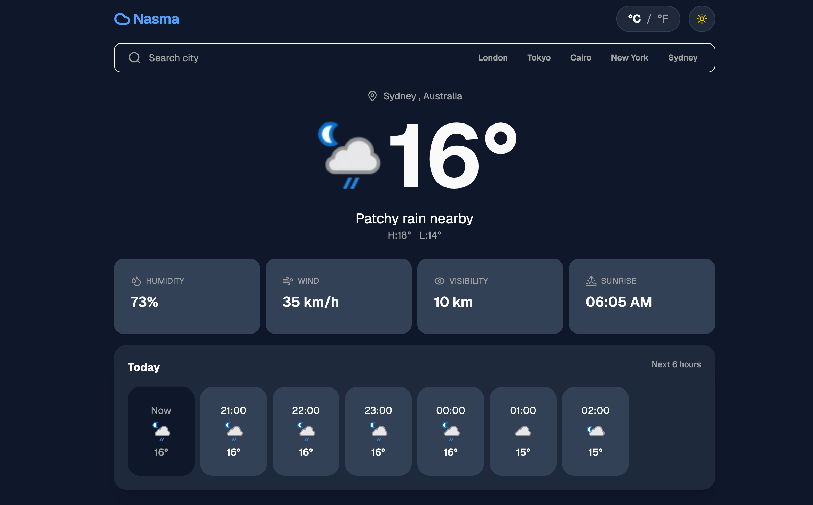

# Nasma

A weather application that allows users to search for cities and view current weather conditions and forecasts.

[Live Demo](https://nasma-weather-app.vercel.app)

## Preview



## Tech Stack

- React
- TypeScript
- Vite
- Tailwind CSS
- Zustand
- WeatherAPI

## Getting Started

### Installation

```bash
git clone https://github.com/Hibaz108/nasma-weather-app.git
cd nasma-weather-app
npm install
```

Create a `.env` file in the root directory and add your WeatherAPI key:

```env
VITE_API_KEY=your_api_key
```

You can get your API key by creating an account on [WeatherAPI](https://www.weatherapi.com/).

Run the development server:

```bash
npm run dev
```
